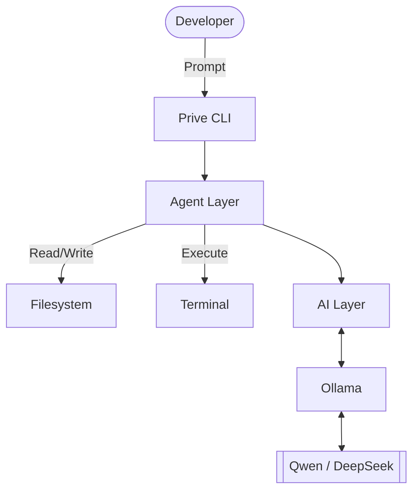

<div align="center">

<pre>
<font color="#dc2626">██████╗ ██████╗ ██╗██╗   ██╗███████╗</font>
<font color="#ef4444">██╔══██╗██╔══██╗██║██║   ██║██╔════╝</font>
<font color="#f87171">██████╔╝██████╔╝██║██║   ██║█████╗  </font>
<font color="#a78bfa">██╔═══╝ ██╔══██╗██║╚██╗ ██╔╝██╔══╝  </font>
<font color="#8b5cf6">██║     ██║  ██║██║ ╚████╔╝ ███████╗</font>
<font color="#7c3aed">╚═╝     ╚═╝  ╚═╝╚═╝  ╚═══╝  ╚══════╝</font>
</pre>

<br/>


<br/>

# <font color="#dc2626">⚡ Prive</font>

### <font color="#8b5cf6">Your Local AI Coding Companion</font>

*Chat. Code. Build. Ship.*

> **No subscriptions. No cloud dependency. No API bills.**
> Powered entirely by local AI models through Ollama.

<br/>


</div>

---

## <font color="#ef4444">🚀 Overview</font>

Prive is an open-source, terminal-first AI coding assistant designed for developers who want complete control over their workflow. 

Unlike cloud-based coding assistants, Prive runs entirely on your machine using local language models such as **Qwen**, **DeepSeek**, and **Llama** through Ollama.

No accounts. No API keys. No monthly bills. **Just code.**

---

## <font color="#f87171">✨ Features</font>

| Capability | Description |
| :--- | :--- |
| 🤖 **Local AI Engine** | Powered by Ollama. Supports Qwen, DeepSeek & Llama. Fully offline capable. |
| 💬 **Interactive Chat** | Project-aware conversations with multi-turn memory & context awareness. |
| 📂 **Workspace Intel** | Reads files, analyzes repos, and generates architecture summaries. |
| ✏️ **Code Generation** | Creates files, modifies syntax, refactors, and generates boilerplate code. |
| 💻 **Terminal Automation** | Executes commands, captures output, monitors processes autonomously. |
| 🌿 **Git Integration** | Repository analysis, smart commit generation, and branch management. |

---

## <font color="#a78bfa">⚡ Commands & Usage</font>

Fire up the intelligence layer with a single command:

```bash
prive
```

### <font color="#8b5cf6">Directives</font>

* **Explain Project:** <kbd>prive explain project</kbd>
* **Analyze File:** <kbd>prive read src/App.tsx</kbd>
* **Run Terminal Commands:** <kbd>prive run npm install</kbd>
* **Version Control:** <kbd>prive git status</kbd>
* **Autonomous Fixes:** <kbd>prive fix LoginScreen.tsx</kbd>

> **🧠 Memory System:** All session history, project preferences, and workspace memory are stored safely offline in your local `.prive/` directory.

---

## <font color="#8b5cf6">🧱 Project Structure</font>

```text
Prive/
│
├── src/
│   ├── cli/           # Terminal UI
│   ├── ai/            # Model communication
│   ├── filesystem/    # I/O operations
│   ├── terminal/      # Command execution
│   ├── git/           # VCS integration
│   ├── agents/        # Autonomous tasks
│   ├── config/        # Setup
│   └── utils/         # Helpers
│
├── tests/
├── docs/
├── .prive/            # Local memory store
│
├── package.json
├── tsconfig.json
└── README.md
```

---

## <font color="#7c3aed">🏗 Architecture Blueprint</font>



---

## <font color="#6d28d9">🚀 Installation Protocol</font>

**1. Clone the repository:**
```bash
git clone [https://github.com/vin1397/prive.git](https://github.com/vin1397/prive.git)
cd prive
```

**2. Install dependencies & run:**
```bash
npm install
npm run dev
```

**3. Setup Ollama Requirements:**
```bash
ollama pull qwen3
ollama list
```

---

## <font color="#5b21b6">🛣 Roadmap</font>

<details>
<summary><b>Click to expand roadmap phases</b></summary>

<br/>

### Phase 1 
* 🟩 Interactive Chat
* 🟩 Ollama Integration
* 🟩 Terminal UI
* 🟩 Qwen Support

### Phase 2
* ⬜ File Reading & Writing
* ⬜ Project Search
* ⬜ Terminal Commands Integration

### Phase 3
* ⬜ Git Integration
* ⬜ Local Memory Storage

### Phase 4
* ⬜ Multi-Agent Architecture
* ⬜ Autonomous Task Planning

### Phase 5
* ⬜ Desktop Studio UI
* ⬜ Voice Development Integration

</details>

---

## <font color="#4c1d95">🤝 Contributing & License</font>

Contributions, suggestions, bug reports, and pull requests are welcome. Let's build the future of local AI together.

Distributed under the **MIT License**.

---

<div align="center">

Built for **Prive** 💜 by **~Vini**

### Prive — Your Local AI Coding Companion

</div>