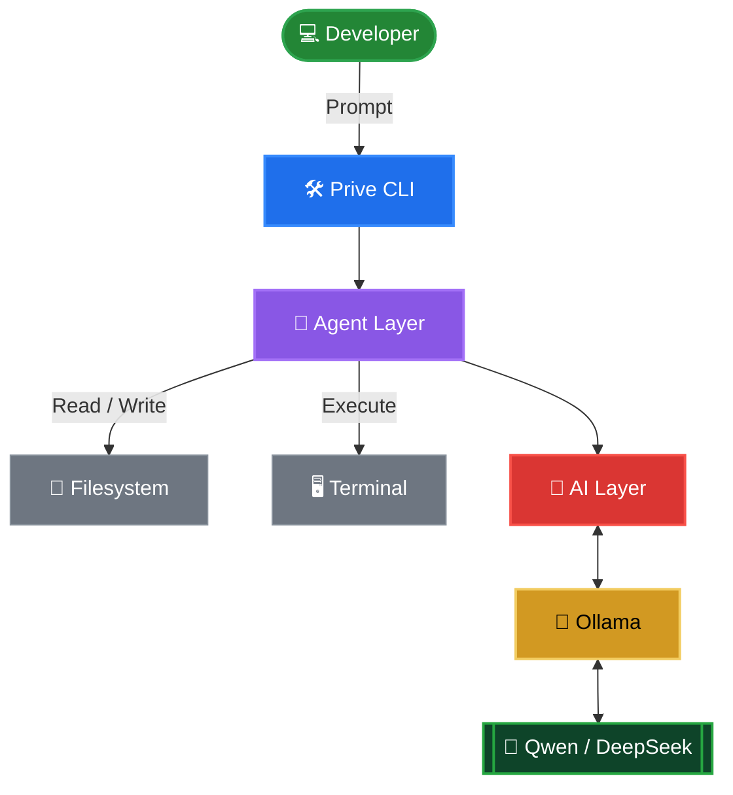

<div align="center">


```
██████╗ ██████╗ ██╗██╗   ██╗███████╗
██╔══██╗██╔══██╗██║██║   ██║██╔════╝
██████╔╝██████╔╝██║██║   ██║█████╗  
██╔═══╝ ██╔══██╗██║╚██╗ ██╔╝██╔══╝  
██║     ██║  ██║██║ ╚████╔╝ ███████╗
╚═╝     ╚═╝  ╚═╝╚═╝  ╚═══╝  ╚══════╝
```

### ⚡ Your Local AI Coding Companion

*Chat. Code. Build. Ship.*

<br/>


<br/>

**No subscriptions. No cloud dependency. No API bills.**

Powered entirely by local AI models through Ollama.

<br/>

</div>

---

<div align="center">

## 🟣 Overview

</div>

Prive is an open-source, terminal-first AI coding assistant built for developers who demand complete control over their workflow and their data.

Unlike cloud-based tools, Prive runs **100% on your machine** using local language models — Qwen, DeepSeek, Llama, and any Ollama-compatible model. No accounts. No API keys. No monthly bills. No telemetry. **Just code.**

---

<div align="center">

## ✨ Features

</div>

<table>
<tr>
<td width="50%">

**🤖 Local AI Engine**
- Powered by Ollama
- Qwen · DeepSeek · Llama · any model
- Fully offline capable
- Zero API keys or usage limits
- Privacy-first by design

**💬 Interactive Chat**
- Project-aware multi-turn conversations
- Full session memory
- Natural language workflows
- Token-aware context trimming

**📂 Workspace Intelligence**
- Read files into AI context
- Analyze entire repositories
- Generate architecture summaries
- Fuzzy file search + content grep

</td>
<td width="50%">

**✏️ Code Generation & Editing**
- Create, modify, and refactor code
- Complete files only — no placeholders
- Automatic backup on overwrite
- Inline diff explanations

**💻 Terminal Automation**
- Execute commands with real-time output
- 21-pattern danger sandbox
- Sequence execution with fail-fast
- Smart stderr capture

**🌿 Git Integration**
- Status, commit, push, pull
- Branch create/switch/merge
- Recent commit log
- Auto stage on commit

</td>
</tr>
</table>

---

<div align="center">

## 🚀 Quick Start

</div>

### 1 · Install Ollama

```bash
# macOS / Linux
curl -fsSL https://ollama.ai/install.sh | sh
ollama serve
```

### 2 · Pull a model

```bash
# Recommended — best for coding
ollama pull qwen2.5-coder

# Alternatives
ollama pull deepseek-coder-v2
ollama pull qwen3
ollama pull codellama
```

### 3 · Install Prive

```bash
git clone https://github.com/vin1397/prive.git
cd prive
npm install
npm run build
npm link
```

### 4 · Run

```bash
cd ~/your-project
prive
```

```
 ██████╗ ██████╗ ██╗██╗   ██╗███████╗
 ...

  ⚡ Your Local AI Coding Companion · v0.1.0

╔══════════════════ ⚡ PRIVE DASHBOARD ══════════════════╗
║  ⚙  CPU           23%    ████░░░░░░░░░░░░  23%        ║
║  🧠  Memory        4.1/16 GB  ██░░░░░░░░░░  26%       ║
║  🌡  Temp          54°C                                ║
║  🤖  Model         qwen2.5-coder                       ║
║  📂  Project       your-project                        ║
╚════════════════════════════════════════════════════════╝

[CPU 23%·RAM 26%·54°C] ❯ _
```

---

<div align="center">

## 💬 Usage

</div>

### Chat — just type

```
❯ explain what this project does
❯ how do I add rate limiting to Express routes?
❯ what's the idiomatic way to handle errors in Go?
```

### Load files into context

```
❯ /read src/auth.ts
❯ refactor this to use async/await throughout
```

### Generate and write code

```
❯ /write src/utils/date.ts utility functions for date formatting
```

### Debug an error

```
❯ /debug TypeError: Cannot read properties of undefined (reading 'map')
```

### Git workflow

```
❯ /git status
❯ /git commit feat: add user authentication
❯ /git push
```

### Run terminal commands

```
❯ /run npm install
❯ /run npm test
```

---

<div align="center">

## 📋 Commands

</div>

| Command | Description |
|:--------|:------------|
| `[message]` | Chat with the AI directly |
| `/read <file>` | Read a file into AI context |
| `/write <file> <task>` | Generate and write code to a file |
| `/list` | List all source files |
| `/tree [depth]` | Display the project file tree |
| `/run <cmd>` | Execute a terminal command safely |
| `/git status\|commit\|push\|branch\|log` | Git operations |
| `/grep <pattern>` | Search file contents |
| `/model [name]` | Show or switch the active model |
| `/context [clear]` | Show or clear session context |
| `/history` | View chat history |
| `/memory [clear]` | View or clear saved sessions |
| `/architect` | Analyze project architecture |
| `/debug <error>` | Analyze an error with AI |
| `/clear` | Clear the terminal |
| `/exit` | Quit Prive |

---

<div align="center">

## 🤖 Agent System

</div>

Prive ships three specialized AI agents, each with its own focused system prompt and conversation state:

<table>
<tr>
<td align="center" width="33%">

**🏗️ Architect**

Analyzes project structure, identifies architectural patterns, highlights concerns, and suggests concrete improvements.

`/architect`

</td>
<td align="center" width="33%">

**⚙️ Coder**

Generates, refactors, and explains code. Always produces complete, working files — never stubs or placeholders.

`/write` · `/read` + chat

</td>
<td align="center" width="33%">

**🐛 Debugger**

Analyzes error messages, identifies root causes, and can apply fixes directly to files with auto-backup.

`/debug`

</td>
</tr>
</table>

---

<div align="center">

## 🧠 Memory System

</div>

All session data is stored locally inside your project:

```
.prive/
├── memory.json      # Last 50 conversation sessions
├── projects.json    # Known projects + last model used
└── settings.json    # Your preferences
```

Sessions are saved automatically on exit. Memory never leaves your machine.

---

<div align="center">

## 🖥️ Live System Dashboard

</div>

Every time you launch Prive, a live system dashboard renders in your terminal:

```
╔══════════════════════ ⚡ PRIVE DASHBOARD ══════════════════════╗
║                                                               ║
║   ◆ SYSTEM ──────────────────────────────────────────         ║
║                                                               ║
║   ⚙  CPU           23%     ████░░░░░░░░░░░░  23%             ║
║   🧠  Memory        4.1/16   ██░░░░░░░░░░░░░  26%            ║
║   🌡  Temp          54°C                                      ║
║   🎮  GPU           12% · 2048/8192 MB                        ║
║   🌐  Network       192.168.1.10                              ║
║   ⏱  Uptime        6h 32m                                    ║
║   📊  Load avg      0.48  0.31  0.22    1m · 5m · 15m        ║
║   💻  Platform      macOS arm64                               ║
║   🔢  CPU cores     10                                        ║
║                                                               ║
║   ◆ PRIVE ───────────────────────────────────────────         ║
║                                                               ║
║   🤖  Model         qwen2.5-coder                             ║
║   📂  Project       my-project                                ║
║   🧩  Agents        Architect · Coder · Debugger              ║
║   🔒  Privacy       100% local · no telemetry                 ║
╚═══════════════════════════════════════════════════════════════╝
```

The prompt line updates live every 2 seconds:

```
[CPU 23%·RAM 26%·54°C·GPU 12%] ❯ _
```

---

<div align="center">

## 🔧 Configuration

</div>

`.prive/settings.json`:

```json
{
  "model": "qwen2.5-coder",
  "ollamaHost": "http://localhost:11434",
  "temperature": 0.7,
  "streamResponses": true,
  "autoSaveMemory": true,
  "maxHistoryLength": 50
}
```

Switch model on the fly:

```
❯ /model deepseek-coder-v2
```

---

<div align="center">

## 🔌 Supported Models

</div>

| Model | Best For | Context |
|:------|:---------|:--------|
| `qwen2.5-coder` ⭐ | Code generation, review, refactoring | 32K |
| `qwen3` ⭐ | Reasoning + coding | 32K |
| `deepseek-coder-v2` ⭐ | Complex algorithms, multi-language | 64K |
| `deepseek-r1` | Reasoning, debugging | 32K |
| `codellama` | Code completion | 16K |
| `llama3.2` | General questions, explanations | 8K |
| `mistral` | Fast general-purpose | 8K |

Any Ollama-compatible model works.

---

<div align="center">

## 🧱 Project Structure

</div>

```
Prive/
│
├── src/
│   ├── cli/              # Entry point · command router · prompt
│   │   ├── index.ts
│   │   ├── commands.ts   # 15 commands with full handlers
│   │   └── prompt.ts     # Live system stats in prompt line
│   │
│   ├── ai/               # AI layer
│   │   ├── ollama.ts     # Streaming HTTP client
│   │   ├── chat.ts       # History + context trimming
│   │   ├── context.ts    # File → prompt builder
│   │   └── memory.ts     # Session persistence
│   │
│   ├── agents/           # Specialized AI agents
│   │   ├── coder.ts
│   │   ├── debugger.ts
│   │   └── architect.ts
│   │
│   ├── filesystem/       # I/O operations
│   │   ├── read.ts
│   │   ├── write.ts      # With auto-backup support
│   │   ├── search.ts     # Grep · glob · find
│   │   └── tree.ts
│   │
│   ├── terminal/         # Command execution
│   │   ├── execute.ts    # Streaming output
│   │   └── sandbox.ts    # 21 danger patterns
│   │
│   ├── git/              # Git operations
│   │   ├── status.ts
│   │   ├── commit.ts
│   │   ├── push.ts
│   │   └── branch.ts
│   │
│   ├── config/
│   │   ├── constants.ts
│   │   ├── models.ts     # 8 model definitions
│   │   └── settings.ts
│   │
│   └── utils/
│       ├── logger.ts     # Live dashboard · system metrics
│       ├── spinner.ts
│       └── helpers.ts
│
├── tests/
│   ├── ai.test.ts        # 13 tests
│   ├── fs.test.ts        # 24 tests
│   └── git.test.ts       # 26 tests  ← 63 total, all passing
│
├── docs/
│   ├── architecture.md
│   ├── commands.md
│   └── roadmap.md
│
└── .prive/               # Local memory store (gitignored)
    ├── memory.json
    ├── projects.json
    └── settings.json
```

---

<div align="center">

## 🏗 Architecture

</div>



---

<div align="center">

## 🛣️ Roadmap

</div>

### Phase 1 — Foundation ✅
- 🟣 Interactive Chat
- 🟣 Ollama Integration
- 🟣 Terminal UI with live dashboard
- 🟣 Qwen / DeepSeek / Llama support

### Phase 2 — Workspace ✅
- 🟣 File Reading & Writing (with backup)
- 🟣 Project Search (glob + grep + fuzzy)
- 🟣 Terminal Commands Integration (sandbox)

### Phase 3 — VCS & Memory ✅
- 🟣 Git Integration (status · commit · push · branch · log)
- 🟣 Local Memory Storage (session history + project registry)

### Phase 4 — Agents ✅
- 🟣 Multi-Agent Architecture (Coder · Debugger · Architect)
- 🟣 Autonomous Task Planner (chain agents across multi-step goals)

### Phase 5 — Studio ⚡ In Progress
- 🟣 Desktop Studio UI (Electron — chat, file tree, git, terminal, metrics)
- 🔲 Voice Development Integration (local Whisper — planned v0.6)
- ⬜ Generate images

### Phase 6 — Ecosystem ⚡ In Progress
- 🟣 Plugin system (.prive/plugins/ — load custom .mjs commands)
- 🟣 MCP server (JSON-RPC · compatible with Claude Desktop, Cursor)
- 🟣 VS Code extension (chat panel, explain, refactor, debug, commit)
- 🔲 Remote workspace support

---

<div align="center">

## 🔒 Privacy

</div>

| Principle | Detail |
|:----------|:-------|
| 🔒 Zero telemetry | No analytics, no tracking, no crash reports |
| 🏠 Local inference | All AI runs via Ollama on your machine |
| 💾 Local storage | `.prive/` in your project — never synced |
| 👁️ Open source | Audit every line |
| ✈️ Offline capable | Works with no internet connection |

---

<div align="center">

## 🛠️ Development

</div>

```bash
# Install dependencies
npm install

# Dev mode (ts-node, no build needed)
npm run dev

# Build TypeScript
npm run build

# Run all 63 tests
npm test

# Watch mode
npm run test:watch
```

---

<div align="center">

## 🤝 Contributing

</div>

Contributions, bug reports, and pull requests are welcome.

1. Fork the repository
2. Create a feature branch: `git checkout -b feat/my-feature`
3. Write tests for new functionality
4. Ensure all tests pass: `npm test`
5. Submit a pull request

---

<div align="center">


Built For **Prive**💜 by **~Vin**

**Prive — Your Local AI Coding Companion**

*MIT License · Open Source · Local First · Privacy Focused*

</div>